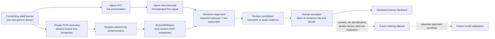

# GabayBigkas: two independent transcripts, one human-reviewed decision

## One-slide architecture

**What each signal means**

| Signal | Role | Authority |
| --- | --- | --- |
| Agora raw transcript | Live, timestamped view of what Agora heard | Independent signal; forwarding into the product still needs live verification |
| BuzzASR/filipino | Post-session transcript from the independent recording | Independent comparator; never an automatic pronunciation verdict |
| Human annotation | Reviews the actual clip and both transcripts in sentence context | Final reviewed label for that specific case |

BuzzASR/filipino is a Whisper-large-v3 model **fine-tuned for Filipino-language ASR**. Its published evaluation is for Filipino speech, not validated Filipino-accented English pronunciation. The application uses it to surface transcript disagreements for review; **BuzzASR is not the source of truth**. Noise, code-switching, and accent can make either transcript wrong. A mismatch is a review candidate, not proof that the learner pronounced a word incorrectly.

**Feedback loop:** With consent and retention controls, adjudicated cases could become a curated dataset for future model adaptation. Retraining, deployment, and improvement measurement are **not implemented**. Keep a held-out test set and compare WER/CER plus human review outcomes before claiming gains on Filipino-accented English.

**Slide-ready line:** “Two independent ASR signals identify sentences worth reviewing. A human annotator confirms the evidence; reviewed cases can support future model improvement.”

Sources: [BuzzASR/filipino model card](https://huggingface.co/BuzzASR/filipino), [canonical system scope](../SYSTEM.md), [pronunciation-coach architecture](PRONUNCIATION_COACH_ARCHITECTURE.md).
